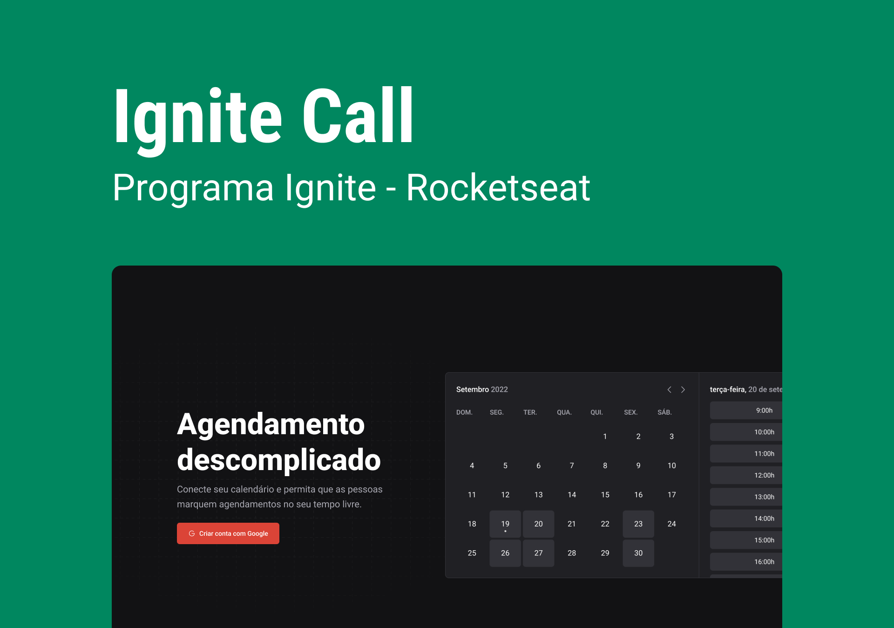

<div align="center">
  
</div>

# Ignite Call

Conecte seu calendário do Google e permita que as pessoas marquem agendamentos no seu tempo livre, enviando os compromissos criados diretamente a sua agenda pessoal.

<div align="center">
    
</div>

## 🚀 Tecnologias

Esse projeto foi desenvolvido com as seguintes tecnologias:

- [Next.js](https://nextjs.org/)
- [TypeScript](https://www.typescriptlang.org/)
- [NextAuth](https://next-auth.js.org/)
- [Google APIs](https://www.npmjs.com/package/googleapis)
- [Prisma](https://www.prisma.io/)
- [Design System](https://mateussantanasilva.github.io/DesignSystem)
- [Stitches](https://stitches.dev/)
- [React Query - TanStack Query](https://tanstack.com/query/latest)
- [Axios](https://axios-http.com/ptbr/docs/intro)
- [Zod](https://zod.dev/)
- [ESLint](https://eslint.org/)
- [Prettier](https://prettier.io/)
- [Day.js](https://day.js.org/)
    
## 💻 Acesse o projeto online

- [https://ignitecallapp.vercel.app/](https://ignitecallapp.vercel.app/)

## 💻 Acessar os projetos local

### :white_check_mark: Requisitos ###

Antes de começar :checkered_flag:, você precisa ter o [Git](https://git-scm.com) e o [Node](https://nodejs.org/en/) instalados.

### :checkered_flag: Começo ###

```bash
# Clone o projeto
$ git clone https://github.com/mateussantanasilva/IgniteCall.git

# Acesse a pasta clonada
$ cd IgniteCall/

# Instale as dependências
$ npm install

# Execute o projeto
$ npm run dev
```

## 🧑🏻 Autor

[Mateus Santana da Silva](https://github.com/mateussantanasilva)
<div align="left">
  <a href="https://www.linkedin.com/in/mateus-santana-silva/" target="_blank">
    
  </a>
  <a href="mailto:santanasilva1778@gmail.com" target="_blank">
    

## ⚖️ Licença

[MIT License](https://github.com/mateussantanasilva/IgniteCall/blob/main/LICENSE)
